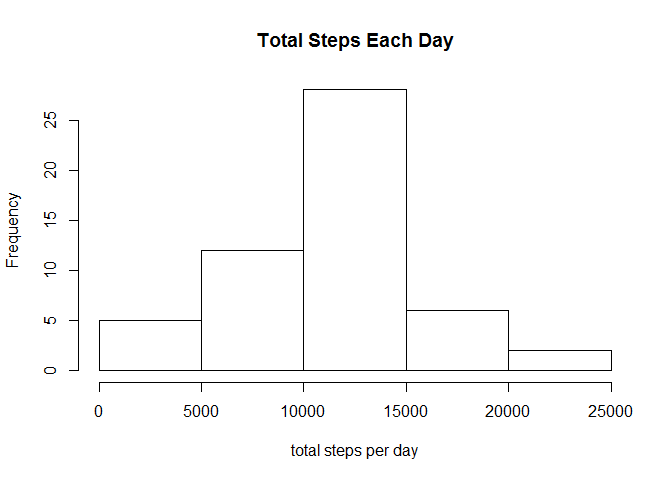
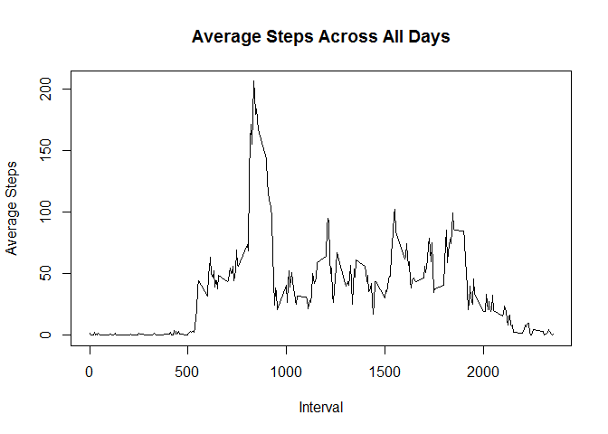
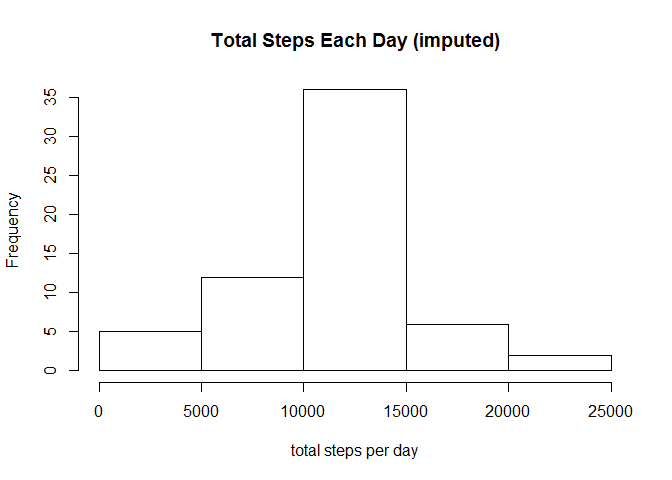
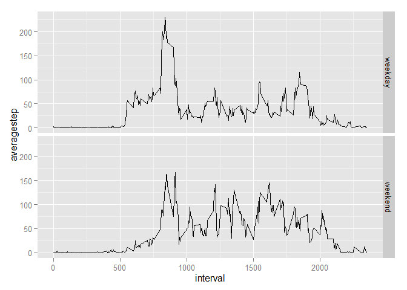

# Reproducible Research: Peer Assessment 1

This document aims to answer the questions listed on Reproducible Research Peer Assignment 1. First, load all the packages that are needed, then set the working directory. 


```r
library(dplyr)
```

```
## 
## Attaching package: 'dplyr'
## 
## The following object is masked from 'package:stats':
## 
##     filter
## 
## The following objects are masked from 'package:base':
## 
##     intersect, setdiff, setequal, union
```

```r
library(tidyr)
library(ggplot2)
library(knitr)
library(lubridate)
setwd("~/reproducible research")
```

## Loading and preprocessing the data


```r
data<-tbl_df(read.csv("activity.csv"))
data$date<-ymd(data$date)
```

## What is mean total number of steps taken per day?

1. Calculate the total number of steps taken per day.

2. Make a histogram of the total number of steps taken each day.

3. Calculate and report the **mean** and **median** of the total number of steps taken per day.


```r
# Remove missing values
data1<-na.omit(data)

# Group the data frame by date and calcluate the total steps
data1<-data1 %>%
        group_by(date) %>%
        summarise(totalstep = sum(steps))
# Make a histograph

hist(data1$totalstep,xlab="total steps per day", main ="Total Steps Each Day")
```

 

```r
mean(data1$totalstep)
```

```
## [1] 10766.19
```

```r
median(data1$totalstep)
```

```
## [1] 10765
```

## What is the average daily activity pattern?

1. Make a time series plot (i.e. type = "l") of the 5-minute interval (x-axis) and the average number of steps taken, averaged across all days (y-axis)

2. Which 5-minute interval, on average across all the days in the dataset, contains the maximum number of steps?


```r
# Remove missing values
data2<-na.omit(data)
# Further process data frame
data2<-data2 %>%
        group_by(interval) %>%
        summarise(averagestep= mean(steps))

#Make time series plot
plot(data2$interval,data2$averagestep,type ="l", xlab= "Interval", ylab= "Average Steps", main="Average Steps Across All Days")
```

 

```r
filter(data2,averagestep==max(averagestep))
```

```
## Source: local data frame [1 x 2]
## 
##   interval averagestep
## 1      835    206.1698
```

**According to the result, the 835 5-minute interval contains the maximum number of steps (206.1698).**

##Imputing missing values

1. Calculate and report the total number of missing values in the dataset (i.e. the total number of rows with NAs)


```r
sum(is.na(data))
```

```
## [1] 2304
```

2. Devise a strategy for filling in all of the missing values in the dataset. The strategy does not need to be sophisticated. For example, you could use the mean/median for that day, or the mean for that 5-minute interval, etc.
   
   In this case, I used the mean for relevant 5-minute interval to replace the NAs. The mean values were generated in previous section. 
   
   

```r
# Remove missing values
data2<-na.omit(data)

# Further process data frame
data2<-data2 %>%
        group_by(interval) %>%
        summarise(averagestep= mean(steps))

data2
```

```
## Source: local data frame [288 x 2]
## 
##    interval averagestep
## 1         0   1.7169811
## 2         5   0.3396226
## 3        10   0.1320755
## 4        15   0.1509434
## 5        20   0.0754717
## 6        25   2.0943396
## 7        30   0.5283019
## 8        35   0.8679245
## 9        40   0.0000000
## 10       45   1.4716981
## ..      ...         ...
```

3. Create a new dataset that is equal to the original dataset but with the missing data filled in.

```r
newdata<- left_join(data,data2,by ="interval")
        for (i in 1:length(newdata$steps)){
        if (is.na(newdata[i,1])) {
                newdata[i,1]<-newdata[i,4]
        }
}
newdata<-select(newdata,steps,date,interval)

newdata
```

```
## Source: local data frame [17,568 x 3]
## 
##        steps       date interval
## 1  1.7169811 2012-10-01        0
## 2  0.3396226 2012-10-01        5
## 3  0.1320755 2012-10-01       10
## 4  0.1509434 2012-10-01       15
## 5  0.0754717 2012-10-01       20
## 6  2.0943396 2012-10-01       25
## 7  0.5283019 2012-10-01       30
## 8  0.8679245 2012-10-01       35
## 9  0.0000000 2012-10-01       40
## 10 1.4716981 2012-10-01       45
## ..       ...        ...      ...
```

4. Make a histogram of the total number of steps taken each day and Calculate and report the mean and median total number of steps taken per day. Do these values differ from the estimates from the first part of the assignment? What is the impact of imputing missing data on the estimates of the total daily number of steps?


```r
newplotdata <- newdata %>%
        group_by(date) %>%
        summarise (totalstep = sum(steps))

hist(newplotdata$totalstep,xlab="total steps per day", main ="Total Steps Each Day (imputed)")  
```

 

```r
mean(data1$totalstep)
```

```
## [1] 10766.19
```

```r
mean(newplotdata$totalstep)
```

```
## [1] 10766.19
```

```r
median(data1$totalstep)
```

```
## [1] 10765
```

```r
median(newplotdata$totalstep)
```

```
## [1] 10766.19
```

**According to the result, after imputing missing value from original data, the mean of the total number of steps did not change,but the median value increased slightly.**

## Are there differences in activity patterns between weekdays and weekends?

1. Create a new factor variable in the dataset with two levels -- "weekday" and "weekend" indicating whether a given date is a weekday or weekend day.


```r
newdata$weekdays<-factor(weekdays(newdata$date))

levels(newdata$weekdays) <- list(weekday =c("Monday", "Tuesday","Wednesday","Thursday","Friday"),weekend =c("Saturday","Sunday"))

newdata
```

```
## Source: local data frame [17,568 x 4]
## 
##        steps       date interval weekdays
## 1  1.7169811 2012-10-01        0  weekday
## 2  0.3396226 2012-10-01        5  weekday
## 3  0.1320755 2012-10-01       10  weekday
## 4  0.1509434 2012-10-01       15  weekday
## 5  0.0754717 2012-10-01       20  weekday
## 6  2.0943396 2012-10-01       25  weekday
## 7  0.5283019 2012-10-01       30  weekday
## 8  0.8679245 2012-10-01       35  weekday
## 9  0.0000000 2012-10-01       40  weekday
## 10 1.4716981 2012-10-01       45  weekday
## ..       ...        ...      ...      ...
```

2. Make a panel plot containing a time series plot (i.e. type = "l") of the 5-minute interval (x-axis) and the average number of steps taken, averaged across all weekday days or weekend days (y-axis).


```r
a<-newdata %>%
        group_by (interval,weekdays) %>%
        mutate(averagestep=mean(steps))

g<-ggplot(a,aes(x=interval,y=averagestep))
g+geom_line()+facet_grid(weekdays ~.)
```

 

